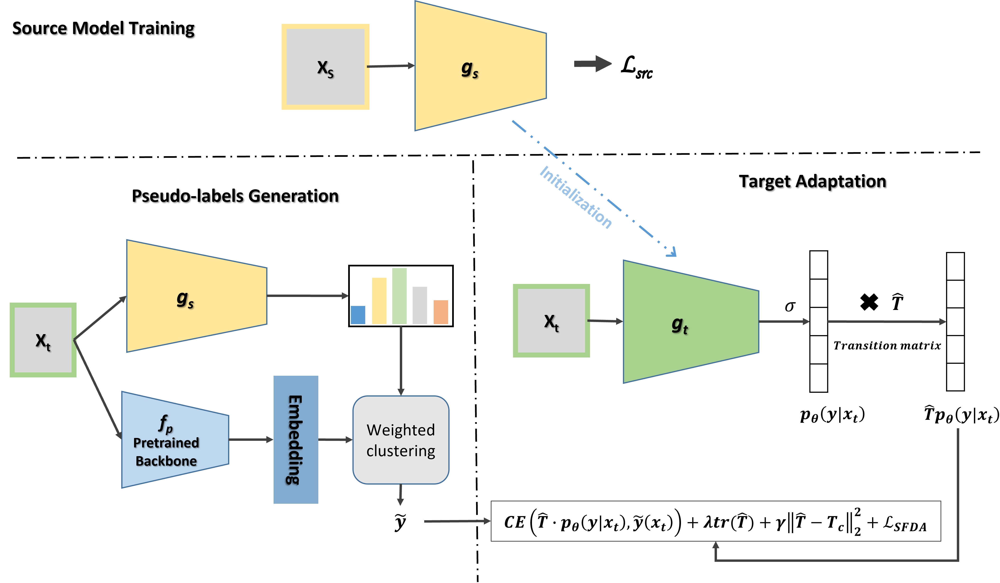

# De-Confusing Pseudo-Labels in Source-Free Domain Adaptation [ECCV 2024]

Source-free domain adaptation (SFDA) aims to adapt a source-trained model to an unlabeled target domain without access to the source data. SFDA has attracted growing attention in recent years, where existing approaches focus on self-training that usually includes pseudo-labeling techniques. In this paper,  we introduce a novel noise-learning approach tailored to address noise distribution in domain adaptation settings and learn to de-confuse the pseudo-labels. More specifically, we learn a noise transition matrix of the pseudo-labels to capture the label corruption of each class and learn the underlying true label distribution. Estimating the noise transition matrix enables a better true class-posterior estimation, resulting in better prediction accuracy. We demonstrate the effectiveness of our approach when combined with several SFDA methods: SHOT, SHOT++, and AaD. We obtain state-of-the-art results on three domain adaptation datasets: VisDA, DomainNet, and OfficeHome.

[[Paper]](https://arxiv.org/pdf/2401.01650)

    
 

----

### Prerequisites

- pip install timm==0.4.12
- python==3.8
- pytorch==1.10.0=py3.8_cuda11.3_cudnn8.2.0_0
- cudatoolkit=11.3
- torchvision==0.11.0
- numpy
- scipy
- scikit-learn
- pillow
- tqdm
- natsort``
- six
- opencv
- scikit-image

### Datasets

- Please manually download the datasets Office-Home, VisDA-C and DomainNet (126)

### Training

#### Pretrained-source models
It is recommended to use pre-trained source models for consistency. 

All pre-trained source models can be downloaded from here:
https://drive.google.com/drive/folders/1-VzIXdyBwjO7Y89c8_TXktIaId7YVEZU?usp=sharing

After downloading, unzip the file and place under `weights` folder, directly in the project's root.

The `weights` folder should now contain 4 sub-folders, named `2019`,`2020`,`2021`,`DN`.

#### Source model training

(please see above for downloading pre-trained source models)

    python train_source.py --class_num 126 --output ./output/weights/sketch_vendor_DN_2021 --dset DomainNet --max_epoch 50 --s 3 --layer wn

#### Target adaptation

#### DomainNet

sketch->clipart

    python train_adapt.py --CM_lr_factor 2.0 --PL_net_to_use SwinBase1K --short_exp_name NADL_DN_126_swin_1K --seed 2021 --dataset_name DomainNet --source sketch --target clipart   

Another example: painting->real

    python train_adapt.py --CM_lr_factor 2.0 --PL_net_to_use SwinBase1K --short_exp_name NADL_DN_126_swin_1K --seed 2021 --dataset_name DomainNet --source painting --target real

##### OfficeHome:

    python train_adapt.py  --CM_lr_factor 1.0 --PL_net_to_use SwinBase1K --short_exp_name NADL_OH_swin_1K --load_downloaded_weights 1 --CM_beta 30 --seed 2021 --dataset_name OfficeHome --source Art --target Clipart --lr_value 1e-2 --batch_size 64 --PL_iteration_amount 2 

Another example:

    python train_adapt.py  --CM_lr_factor 1.0 --PL_net_to_use SwinBase1K --short_exp_name NADL_OH_swin_1K --load_downloaded_weights 1 --CM_beta 30 --seed 2021 --dataset_name OfficeHome --source Product --target RealWorld --lr_value 1e-2 --batch_size 64  --PL_iteration_amount 2 

##### VisDA-C: 

    python train_adapt.py  --cnn_to_use resnet101 --CM_lr_factor 1.0 --CM_prior_loss 1.0 --PL_net_to_use SwinBase1K --short_exp_name VISDA_OH_swin_1K --load_downloaded_weights 1 --CM_beta 5.0 --seed 2021 --dataset_name VisDA-C --target validation --PL_after_epoch 1

``
``